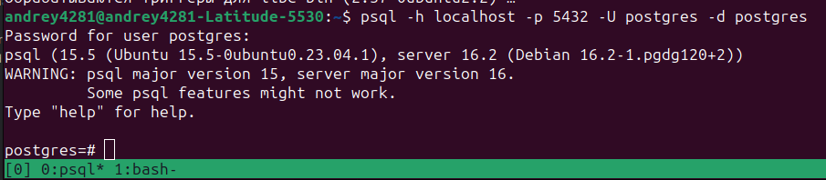
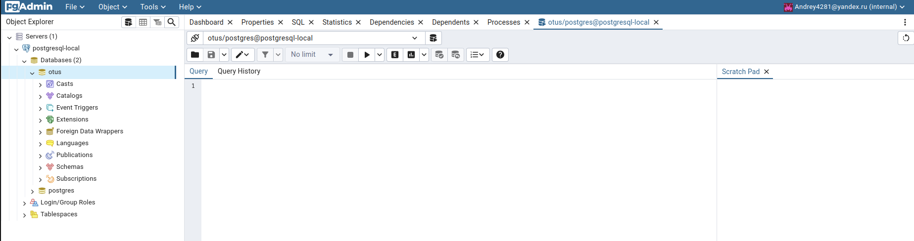

## You can find sql script for creating database in file 'script.sql'
- In this file you can also find a field description

## Local environment for running PostgreSQL and PgAmdin is in the file 'docker-compose.yaml'

## HW1

## By using this studying database you can solve the next tasks:
- We can add a new product of some category and manufacturer
- Customer can find a product from catalog by category and manufacturer and get list of needed products
- Then Customer can choose needed product and check availability among different supplier (See product item table)
- Before creating order we check available balance in customer credit card and product available count for chosen supplier
- After creating order we decrease available count from product_item_table for supplier and balance on customer credit card
- Customer can find all his order for date ranges

# HW2

## Example of queries and indexes
- Find product name with product category and manufacturer name by product category (We can get large list of product):
  
  SELECT p.name, pc.name, m.name FROM otus.product p
  INNER JOIN otus.product_category_ref pcr ON (p.id = pcr.product_id)
  INNER JOIN otus.product_category pc ON (pc.id = pcr.product_category_id)
  INNER JOIN otus.manufacturer m on m.id = p.manufacturer_id
  WHERE pc.id = :category;
  
  For this request we create index "product_category_ref_product_id_product_category_id_idx" see (indexes.sql)

- Find product name with product category and manufacturer name by product's name (We use fulltext search):

  SELECT p.name, pc.name, m.name FROM otus.product p
  INNER JOIN otus.product_category_ref pcr ON (p.id = pcr.product_id)
  INNER JOIN otus.product_category pc ON (pc.id = pcr.product_category_id)
  INNER JOIN otus.manufacturer m on m.id = p.manufacturer_id
  WHERE product_search_name @@ to_tsquery('english', 'computer');

  For this request we create index product_product_search_name_gin see (indexes.sql)

- Find available product_item from different supplier by product:

  SELECT p.name, s.name, pi.price, pi.count FROM otus.product p
  INNER JOIN otus.product_item pi ON (p.id = pi.product_id)
  INNER JOIN otus.supplier s ON (pi.supplier_id = s.id)
  WHERE p.id = 1 AND count > 0;

  For this request we create product_item_product_id_supplier_id_idx see (indexes.sql)

- Find all credit card for customer:

  SELECT * FROM otus.customer c
  INNER JOIN otus.credit_card cc on c.id = cc.customer_id WHERE c.id = 1

  For this request we create credit_card_customer_id_idx see (indexes.sql)

- Find all customers's purchases:

  SELECT c.email,
  p.purchase_delivary_date,
  pi.product_count,
  pi.purchase_item_delivery_date,
  pi.sum,
  s.name,
  p2.name
  FROM otus.customer c
  INNER JOIN otus.purchase p on c.id = p.customer_id
  INNER JOIN otus.purchase_item pi on p.id = pi.id_purchase
  INNER JOIN otus.product p2 on p2.id = pi.id_product
  INNER JOIN otus.supplier s on s.id = pi.id_supplier
  WHERE c.id = 1;

  For this request we create purchase_customer_id_idx, purchase_item_id_purchase_idx, purchase_item_id_product_idx, purchase_item_id_supplier_idx see (indexes.sql)

## Constraints
unique: product.name, product_category.name, manufacturer.name, supplier.name, customer.email, customer.phone
greater then or equals zero: credit_card.balance, product_item.count
greater then zero: product_item.price, purchase_item.product_count, purchase_item.sum
See file hw2/script.sql

# HW3
- By using docker-compose.yaml file you can install postgresql server and pqAdmin in the same network (execute command in the folder hw3 - 'docker-compose up -d')
- By using command 'sudo apt-get install postgresql-client' you can install psql on your Ubuntu host or virtual machine
- By using psql or pqAdmin you can connect to you databases

# HW4
- You can find simple example of working with DDL operation in file hw4/script.sql
- Current database schema in file hw4/schema_hw4.png

# HW5
- You can find current database schema in file hw5/script.sql
- You can find initial data in file hw5/insert_script.sql
- Let's consider a query to find first name and last name of customers, who bought a good which price is equal 100
- SELECT c.first_name, c.last_name FROM otus.purchase_item pi
  JOIN otus.purchase p ON  pi.purchase_fk = p.id
  JOIN otus.customer c ON c.id = p.customer_fk
  WHERE total_cost = 100;
- We have the next query plan:
  Gather  (cost=1000.72..57720.30 rows=15 width=14) (actual time=1.501..249.019 rows=86 loops=1)
  "  Output: c.first_name, c.last_name"
  Workers Planned: 2
  Workers Launched: 2
  ->  Nested Loop  (cost=0.71..56718.80 rows=6 width=14) (actual time=1.259..245.555 rows=29 loops=3)
  "        Output: c.first_name, c.last_name"
  Inner Unique: true
  Worker 0:  actual time=1.944..244.566 rows=27 loops=1
  Worker 1:  actual time=0.796..244.825 rows=27 loops=1
  ->  Nested Loop  (cost=0.42..56716.89 rows=6 width=4) (actual time=1.077..241.864 rows=29 loops=3)
  Output: p.customer_fk
  Inner Unique: true
  Worker 0:  actual time=1.737..240.801 rows=27 loops=1
  Worker 1:  actual time=0.612..241.664 rows=27 loops=1
  ->  Parallel Seq Scan on otus.purchase_item pi  (cost=0.00..56666.25 rows=6 width=8) (actual time=0.856..238.120 rows=29 loops=3)
  "                    Output: pi.id, pi.purchase_fk, pi.product_item_fk, pi.amount, pi.total_cost, pi.delivery_date"
  Filter: (pi.total_cost = '100'::numeric)
  Rows Removed by Filter: 1322279
  Worker 0:  actual time=1.562..237.209 rows=27 loops=1
  Worker 1:  actual time=0.404..238.527 rows=27 loops=1
  ->  Index Scan using purchase_pkey on otus.purchase p  (cost=0.42..8.44 rows=1 width=12) (actual time=0.128..0.128 rows=1 loops=86)
  "                    Output: p.id, p.customer_fk, p.delivary_date"
  Index Cond: (p.id = pi.purchase_fk)
  Worker 0:  actual time=0.130..0.130 rows=1 loops=27
  Worker 1:  actual time=0.114..0.114 rows=1 loops=27
  ->  Index Scan using customer_pkey on otus.customer c  (cost=0.29..0.32 rows=1 width=18) (actual time=0.127..0.127 rows=1 loops=86)
  "              Output: c.id, c.first_name, c.last_name"
  Index Cond: (c.id = p.customer_fk)
  Worker 0:  actual time=0.138..0.138 rows=1 loops=27
  Worker 1:  actual time=0.115..0.115 rows=1 loops=27
  Planning Time: 4.380 ms
  Execution Time: 249.112 ms
- Let's add the index on "total_cost" field:
  CREATE INDEX purchase_item_total_cost_idx ON otus.purchase_item(total_cost);
- Now we have the next plan for the previous query:
  Nested Loop  (cost=1.15..156.68 rows=15 width=14) (actual time=0.060..1.065 rows=86 loops=1)
  "  Output: c.first_name, c.last_name"
  Inner Unique: true
  ->  Nested Loop  (cost=0.85..151.89 rows=15 width=4) (actual time=0.056..0.828 rows=86 loops=1)
  Output: p.customer_fk
  Inner Unique: true
  ->  Index Scan using purchase_item_total_cost_idx on otus.purchase_item pi  (cost=0.43..25.29 rows=15 width=8) (actual time=0.045..0.543 rows=86 loops=1)
  "              Output: pi.id, pi.purchase_fk, pi.product_item_fk, pi.amount, pi.total_cost, pi.delivery_date"
  Index Cond: (pi.total_cost = '100'::numeric)
  ->  Index Scan using purchase_pkey on otus.purchase p  (cost=0.42..8.44 rows=1 width=12) (actual time=0.003..0.003 rows=1 loops=86)
  "              Output: p.id, p.customer_fk, p.delivary_date"
  Index Cond: (p.id = pi.purchase_fk)
  ->  Index Scan using customer_pkey on otus.customer c  (cost=0.29..0.32 rows=1 width=18) (actual time=0.002..0.002 rows=1 loops=86)
  "        Output: c.id, c.first_name, c.last_name"
  Index Cond: (c.id = p.customer_fk)
  Planning Time: 0.369 ms
  Execution Time: 1.089 ms
- We can see execution time is equals 1.089 ms. It's faster then query execution without index more than 228 times
- Let's consider a query to find customer by first name or last name by using full text search in postgresql.
  ALTER table otus.customer ADD column customer_search tsvector;
  UPDATE otus.customer SET customer_search = to_tsvector('english', first_name || ' ' || last_name);
  SELECT * FROM otus.customer WHERE customer_search @@ to_tsquery('english', 'Acevedo');
- We have the next query plan for select:
  Seq Scan on otus.customer  (cost=0.00..2945.45 rows=122 width=51) (actual time=0.338..18.855 rows=102 loops=1)
  "  Output: id, first_name, last_name, customer_search"
  Filter: (customer.customer_search @@ '''acevedo'''::tsquery)
  Rows Removed by Filter: 101614
  Planning Time: 3.249 ms
  Execution Time: 18.888 ms
- Let's add index for full text search:
  CREATE INDEX customer_customer_search_gin ON otus.customer USING gin(customer_search);
- Now we have the next query plan for the previous query:
  Bitmap Heap Scan on otus.customer  (cost=13.45..392.99 rows=122 width=51) (actual time=0.027..0.098 rows=102 loops=1)
  "  Output: id, first_name, last_name, customer_search"
  Recheck Cond: (customer.customer_search @@ '''acevedo'''::tsquery)
  Heap Blocks: exact=102
  ->  Bitmap Index Scan on customer_customer_search_gin  (cost=0.00..13.42 rows=122 width=0) (actual time=0.017..0.017 rows=102 loops=1)
  Index Cond: (customer.customer_search @@ '''acevedo'''::tsquery)
  Planning Time: 0.230 ms
  Execution Time: 0.113 ms
- We can see execution time is equals 0.113 ms. It's faster then query execution without index more than 167 times
- Let's consider a query to find first name and last name of customers, who bought a good which price is equal 100
- SELECT c.first_name, c.last_name FROM otus.purchase_item pi
  JOIN otus.purchase p ON  pi.purchase_fk = p.id
  JOIN otus.customer c ON c.id = p.customer_fk
  WHERE total_cost = 100;
- We have the next query plan:
  Gather  (cost=1000.72..57720.30 rows=15 width=14) (actual time=1.501..249.019 rows=86 loops=1)
  "  Output: c.first_name, c.last_name"
  Workers Planned: 2
  Workers Launched: 2
  ->  Nested Loop  (cost=0.71..56718.80 rows=6 width=14) (actual time=1.259..245.555 rows=29 loops=3)
  "        Output: c.first_name, c.last_name"
  Inner Unique: true
  Worker 0:  actual time=1.944..244.566 rows=27 loops=1
  Worker 1:  actual time=0.796..244.825 rows=27 loops=1
  ->  Nested Loop  (cost=0.42..56716.89 rows=6 width=4) (actual time=1.077..241.864 rows=29 loops=3)
  Output: p.customer_fk
  Inner Unique: true
  Worker 0:  actual time=1.737..240.801 rows=27 loops=1
  Worker 1:  actual time=0.612..241.664 rows=27 loops=1
  ->  Parallel Seq Scan on otus.purchase_item pi  (cost=0.00..56666.25 rows=6 width=8) (actual time=0.856..238.120 rows=29 loops=3)
  "                    Output: pi.id, pi.purchase_fk, pi.product_item_fk, pi.amount, pi.total_cost, pi.delivery_date"
  Filter: (pi.total_cost = '100'::numeric)
  Rows Removed by Filter: 1322279
  Worker 0:  actual time=1.562..237.209 rows=27 loops=1
  Worker 1:  actual time=0.404..238.527 rows=27 loops=1
  ->  Index Scan using purchase_pkey on otus.purchase p  (cost=0.42..8.44 rows=1 width=12) (actual time=0.128..0.128 rows=1 loops=86)
  "                    Output: p.id, p.customer_fk, p.delivary_date"
  Index Cond: (p.id = pi.purchase_fk)
  Worker 0:  actual time=0.130..0.130 rows=1 loops=27
  Worker 1:  actual time=0.114..0.114 rows=1 loops=27
  ->  Index Scan using customer_pkey on otus.customer c  (cost=0.29..0.32 rows=1 width=18) (actual time=0.127..0.127 rows=1 loops=86)
  "              Output: c.id, c.first_name, c.last_name"
  Index Cond: (c.id = p.customer_fk)
  Worker 0:  actual time=0.138..0.138 rows=1 loops=27
  Worker 1:  actual time=0.115..0.115 rows=1 loops=27
  Planning Time: 4.380 ms
  Execution Time: 249.112 ms
- Let's add the partial index on "total_cost" field:
  CREATE INDEX purchase_item_total_cost_partial_idx ON otus.purchase_item(total_cost) WHERE total_cost < 120;
- Now we have the next plan for the previous query:
  Nested Loop  (cost=1.12..158.60 rows=15 width=14) (actual time=0.045..1.011 rows=86 loops=1)
  "  Output: c.first_name, c.last_name"
  Inner Unique: true
  ->  Nested Loop  (cost=0.71..151.75 rows=15 width=4) (actual time=0.037..0.790 rows=86 loops=1)
  Output: p.customer_fk
  Inner Unique: true
  ->  Index Scan using purchase_item_total_cost_partial_idx on otus.purchase_item pi  (cost=0.29..25.15 rows=15 width=8) (actual time=0.030..0.520 rows=86 loops=1)
  "              Output: pi.id, pi.purchase_fk, pi.product_item_fk, pi.amount, pi.total_cost, pi.delivery_date"
  Index Cond: (pi.total_cost = '100'::numeric)
  ->  Index Scan using purchase_pkey on otus.purchase p  (cost=0.42..8.44 rows=1 width=12) (actual time=0.003..0.003 rows=1 loops=86)
  "              Output: p.id, p.customer_fk, p.delivary_date"
  Index Cond: (p.id = pi.purchase_fk)
  ->  Index Scan using customer_pkey on otus.customer c  (cost=0.42..0.46 rows=1 width=18) (actual time=0.002..0.002 rows=1 loops=86)
  "        Output: c.id, c.first_name, c.last_name, c.customer_search"
  Index Cond: (c.id = p.customer_fk)
  Planning Time: 0.373 ms
  Execution Time: 1.033 ms
- We can see execution time is equals 1.033 ms. It's faster then query execution without index more than 241 times
- Let's consider a query to find first name and last name of customers, who bought a good which price is less than 100 and amount is less than 3:
  EXPLAIN (COSTS, VERBOSE, format text, analyze ) SELECT c.first_name, c.last_name FROM otus.purchase_item pi
  JOIN otus.purchase p ON  pi.purchase_fk = p.id
  JOIN otus.customer c ON c.id = p.customer_fk
  WHERE total_cost < 100 AND amount < 3;
- We have the next query plan:
  Gather  (cost=1000.84..61824.67 rows=7 width=14) (actual time=0.894..115.669 rows=19 loops=1)
  "  Output: c.first_name, c.last_name"
  Workers Planned: 2
  Workers Launched: 2
  ->  Nested Loop  (cost=0.84..60823.97 rows=3 width=14) (actual time=4.497..111.495 rows=6 loops=3)
  "        Output: c.first_name, c.last_name"
  Inner Unique: true
  Worker 0:  actual time=10.923..109.513 rows=4 loops=1
  Worker 1:  actual time=1.868..110.993 rows=9 loops=1
  ->  Nested Loop  (cost=0.42..60822.60 rows=3 width=4) (actual time=4.484..111.447 rows=6 loops=3)
  Output: p.customer_fk
  Inner Unique: true
  Worker 0:  actual time=10.905..109.465 rows=4 loops=1
  Worker 1:  actual time=1.852..110.924 rows=9 loops=1
  ->  Parallel Seq Scan on otus.purchase_item pi  (cost=0.00..60797.28 rows=3 width=8) (actual time=4.460..111.387 rows=6 loops=3)
  "                    Output: pi.id, pi.purchase_fk, pi.product_item_fk, pi.amount, pi.total_cost, pi.delivery_date"
  Filter: ((pi.total_cost < '100'::numeric) AND (pi.amount < '3'::numeric))
  Rows Removed by Filter: 1322302
  Worker 0:  actual time=10.866..109.401 rows=4 loops=1
  Worker 1:  actual time=1.832..110.846 rows=9 loops=1
  ->  Index Scan using purchase_pkey on otus.purchase p  (cost=0.42..8.44 rows=1 width=12) (actual time=0.008..0.008 rows=1 loops=19)
  "                    Output: p.id, p.customer_fk, p.delivary_date"
  Index Cond: (p.id = pi.purchase_fk)
  Worker 0:  actual time=0.014..0.014 rows=1 loops=4
  Worker 1:  actual time=0.007..0.008 rows=1 loops=9
  ->  Index Scan using customer_pkey on otus.customer c  (cost=0.42..0.46 rows=1 width=18) (actual time=0.007..0.007 rows=1 loops=19)
  "              Output: c.id, c.first_name, c.last_name, c.customer_search"
  Index Cond: (c.id = p.customer_fk)
  Worker 0:  actual time=0.010..0.010 rows=1 loops=4
  Worker 1:  actual time=0.007..0.007 rows=1 loops=9
  Planning Time: 0.207 ms
  Execution Time: 115.696 ms
- Let's add the composite index on "total_cost" and "amount" fields:
  CREATE INDEX purchase_item_total_cost_amount_idx ON otus.purchase_item(total_cost, amount);
- Now we have the next plan for the previous query:
  Nested Loop  (cost=1.27..290.37 rows=7 width=14) (actual time=0.071..0.885 rows=19 loops=1)
  "  Output: c.first_name, c.last_name"
  Inner Unique: true
  ->  Nested Loop  (cost=0.85..287.17 rows=7 width=4) (actual time=0.066..0.826 rows=19 loops=1)
  Output: p.customer_fk
  Inner Unique: true
  ->  Index Scan using purchase_item_total_cost_amount_idx on otus.purchase_item pi  (cost=0.43..228.09 rows=7 width=8) (actual time=0.058..0.757 rows=19 loops=1)
  "              Output: pi.id, pi.purchase_fk, pi.product_item_fk, pi.amount, pi.total_cost, pi.delivery_date"
  Index Cond: ((pi.total_cost < '100'::numeric) AND (pi.amount < '3'::numeric))
  ->  Index Scan using purchase_pkey on otus.purchase p  (cost=0.42..8.44 rows=1 width=12) (actual time=0.003..0.003 rows=1 loops=19)
  "              Output: p.id, p.customer_fk, p.delivary_date"
  Index Cond: (p.id = pi.purchase_fk)
  ->  Index Scan using customer_pkey on otus.customer c  (cost=0.42..0.46 rows=1 width=18) (actual time=0.003..0.003 rows=1 loops=19)
  "        Output: c.id, c.first_name, c.last_name, c.customer_search"
  Index Cond: (c.id = p.customer_fk)
  Planning Time: 0.407 ms
  Execution Time: 0.904 ms
- We can see execution time is equals 0.904 ms. It's faster then query execution without index more than 127 times

# HW7
- Query with regular expression. I want to find customer whose first name begins with 'Al' and last begin with 'Tr' or 'Tu'
  SELECT * FROM otus.customer WHERE first_name ~ 'Al' and last_name ~ 'T[ru]';
- Query with INNER JOIN. I want to find customers and their emails whose first name begins with 'Al' and last begin with 'Tr' or 'Tu':
  SELECT * FROM otus.customer c
  INNER JOIN otus.email e ON e.customer_fk = c.id
  WHERE c.first_name ~ 'Al' and c.last_name ~ 'T[ru]';
  Changing join order in from expression doesn't change query result because inner join is commutative operation:
  SELECT * FROM otus.email e
  INNER JOIN otus.customer c ON e.customer_fk = c.id
  WHERE c.first_name ~ 'Al' and c.last_name ~ 'T[ru]';
- Query with LEFT JOIN. I want to find customers and their emails or without them whose first name begins with 'Al' and last begin with 'Tr' or 'Tu':
  SELECT * FROM otus.customer c
  LEFT JOIN otus.email e ON e.customer_fk = c.id
  WHERE c.first_name ~ 'Al' and c.last_name ~ 'T[ru]';
  Query result size is equal record count in first table (otus.customer) which meet the conditions in where clause:
  Changing join order will change result of query because we will get all email with customers or without it.
  Query result size is equal record count in first table (otus.email)
  SELECT * FROM otus.email e
  LEFT JOIN otus.customer c ON e.customer_fk = c.id
  WHERE c.first_name ~ 'Al' and c.last_name ~ 'T[ru]';
- Insert with returning information about inserted records:
  INSERT INTO otus.email(email_text, active, main, customer_fk) VALUES ('AliceTran@mail.ru', true, true, 1988),
  ('AliceTran@yandex.ru', true, false, 1988),
  ('AliceTran@gmail.ru', false, false, 1988),
  ('AliceTucker@proton.com', true, true, 1992),
  ('AliceTrevino@yandex.ru', true, true, 1990) RETURNING *;
- Update query with from clause. Let's deactivate emails whose first name begins with 'Al' and last begin with 'Tr' or 'Tu'
  UPDATE otus.email SET active = false FROM
  (SELECT c.first_name, c.last_name, c.id FROM otus.customer c) as cust
  WHERE cust.id = customer_fk
  AND cust.first_name ~ 'Al'
  AND cust.last_name ~ 'T[ru]'
  returning *;
- Delete query with using. Let's delete emails whose first name begins with 'Al' and last begin with 'Tr' or 'Tu'
  DELETE FROM otus.email e
  USING otus.customer c
  WHERE c.id = e.customer_fk
  AND c.first_name ~ 'Al'
  AND c.last_name ~ 'T[ru]' RETURNING e.*;

# HW8 Replication 
## Physical replication
We will use docker-compose.yaml (hw8/docker-compose.yaml) and create clusters in the same docker container
1) Execute the command `docker-compose up -d` in folder hw8
2) Execute the command to enter in container with postgesql: `docker exec -it {id_container_with_postgresql) bash`,
and then execute `su postgres`
3) Execute the command to create master cluster of postgresql: `pg_createcluster -d /var/lib/postgresql/16/main 16 main`
4) Execute the command to start master cluster `pg_ctlcluster 16 main start`
5) Let's connect to master cluster `psql -U postgres -p 5433`,
You can also to watch list of databases by using `\l`
6) Let's create a new database `create database otus;` and connect to the database
   `\c otus`
7) Let's create a new schema `CREATE SCHEMA IF NOT EXISTS otus;`
8) Let's create a new table `CREATE TABLE IF NOT EXISTS otus.customer (
"id" INTEGER GENERATED BY DEFAULT AS IDENTITY PRIMARY KEY NOT NULL,
"first_name" varchar(30) NOT NULL,
"last_name" varchar(30) NOT NULL
);`
9) Let's insert some data `INSERT INTO otus.customer(first_name, last_name) VALUES ('Andrey', 'Semenov'), ('Petr', 'Bars');`
10) Let's check our data `SELECT * FROM otus.customer;` and then exit from psql
    `exit`
11) Execute the command to create slave cluster of postgresql `pg_createcluster -d /var/lib/postgresql/16/slave1 16 slave1`
12) Let's print cluster's list `pg_lsclusters`
13) Let's delete all data of slave cluster `rm -rf /var/lib/postgresql/16/slave1`
14) Let's create physical replication between master cluster and slave cluster `pg_basebackup -p 5433 -R -D /var/lib/postgresql/16/slave1 --create-slot --slot=slave1`
15) Let's create replication delay between master cluster and slave cluster `echo 'recovery_min_apply_delay=5min' >> /var/lib/postgresql/16/slave1/postgresql.auto.conf`
16) Let's start slave cluster `pg_ctlcluster 16 slave1 start`
17) Let's connect to slave cluster `psql -U postgres -p 5434`
18) Let's connect to otus database and check data from master cluster are available in slave cluster
    `\c otus`;
    `select * from otus.customer;`
    `exit`
19) Let's again connect to the master cluster and insert some additional data 
    `psql -U postgres -p 5433`
    `\c otus`
    `INSERT INTO otus.customer(first_name, last_name) VALUES ('Sergey', 'Semenov'), ('Petr', 'Ivanov');`
    `select * from otus.customer;`
    `exit`
20) Let's connect to the slave cluster and check new data in 5 minutes
    `psql -U postgres -p 5434`
    `\c otus`
    `select * from otus.customer;`
    `exit`

## Logical replication
1) Let's again connect to the master cluster and create additional table:
   `psql -U postgres -p 5433`
   `alter system set wal_level=logical;`
   `alter user postgres with password 'postgres';
   `exit`
   `pg_ctlcluster 16 main restart`
   `psql -U postgres -p 5433`
   `\c otus`
   `CREATE TABLE IF NOT EXISTS otus.test (
   "id" INTEGER GENERATED BY DEFAULT AS IDENTITY PRIMARY KEY NOT NULL,
   "name" varchar(30) NOT NULL
   );`
   `INSERT INTO otus.test(name) VALUES ('test1'), ('test2');`
   `select * from otus.test;`
   `create publication test_pub for table test;`
   `exit`
2) Execute the command to create second slave cluster of postgresql 
   `pg_createcluster -d /var/lib/postgresql/16/slave2 16 slave2`
   `pg_ctlcluster 16 slave2 start`
3) Let's create subscription on second slave of postgresql
   `psql -U postgres -p 5435`
   `create database otus;`
   `\c otus`
   `CREATE SCHEMA IF NOT EXISTS otus;`
   `CREATE TABLE IF NOT EXISTS otus.test (
   "id" INTEGER GENERATED BY DEFAULT AS IDENTITY PRIMARY KEY NOT NULL,
   "name" varchar(30) NOT NULL
   );`
   `CREATE SUBSCRIPTION test_sub
   CONNECTION 'host=localhost port=5433 user=postgres
   password=postgres dbname=otus' PUBLICATION test_pub WITH
   (copy_data = true);`
4) Let's add new records on the master cluster and then check second slave:
   `psql -U postgres -p 5433`
   `\c otus`
   `INSERT INTO otus.test(name) VALUES ('test3'), ('test4');`
   `exit`
   `psql -U postgres -p 5435`
   `\c otus`
   `select * from otus.test`
MASTER CLUSTER STATE:

SLAVE PHYSICAL STATE:

SLAVE LOGICAL STATE:

CREATE MASTER CLUSTER

COMMANDS MASTER PHYSICAL

MASTER PHYSICAL REPLICATION SLOTS select * from pg_replication_slots;

# HW9 MySql
1) In the directory hw9 run mysql server by using command: `docker-compose up -d`
2) Check if the container started by the commands: `docker ps`, `docker logs {id_container_with_mysql)`

3) Connect to otus database and check by using commands:
   `docker exec -it {id_container_with_mysql) bash`
   `mysql -u root -p12345 otus`
   `INSERT INTO unit(name) VALUES ('kg'), ('m');`

4) Let's create database for loadtest and prepare test data by using sysbench:
   `docker exec -it {id_container_with_mysql) bash`
   `mysql -u root -p12345 otus`
   `create database test;`
   `exit`
   `exit`
   `sysbench /usr/share/sysbench/oltp_read_write.lua --mysql-host=127.0.0.1 --mysql-port=3309 --mysql-user='root' --mysql-password='12345' --mysql-db=test --db-driver=mysql --tables=1 --table-size=10000000  --threads=80 prepare`
5) Let's run the test
   `sysbench /usr/share/sysbench/oltp_read_write.lua --mysql-host=127.0.0.1 --mysql-port=3309 --mysql-user='root' --mysql-password='12345' --mysql-db=test --db-driver=mysql --tables=1 --table-size=10000000  --threads=80 run`
   
6) Let's edit config and add option innodb_buffer_pool_size. See my.cnf file.
   `innodb_buffer_pool_size=10G`'
7) Restart container with mysql
   `docker-compose stop`
   `docker-compose up -d`
8) Let's run test again:
   `sysbench /usr/share/sysbench/oltp_read_write.lua --mysql-host=127.0.0.1 --mysql-port=3309 --mysql-user='root' --mysql-password='12345' --mysql-db=test --db-driver=mysql --tables=1 --table-size=10000000  --threads=80 run`
   
9) You can see that after optimization we have more transaction per seconds and lower 95 percentile 
10) Let's add additional parameters in our file `my.cnf` and run sysbench again.

# HW10 MySql. Data types.
1) In all tables I changed `integer` and `bigint` postgresql types designed for primary and foreign keys  by `integer UNSIGNED` and `bigint UNSIGNED` mysql types,
because primary and foreign keys are monotonically increasing positive numbers.
2) All varchar types are stayed the same comparing with postgresql
3) All date types without time are stayed the same comparing with postgresql
4) All boolean types without time are stayed the same comparing with postgresql
5) I changed `credit_card.balance`, `product_item.price`, `purchase_item.total_cost` from `decimal(10,2)` to `decimal(19,4)` because money should be stored more precisely
6) You can find all schema in file schema.sql
7) You can see example using of json type in file json.sql

# HW11 Partitioning and tablespace.
In our project tables purchase and purchase_item can contain a large amount of data.
Let's try to optimize oltp operation by using partitioning:
1) See file hw11/script.sql with comments
2) In the future, as the number of suppliers in the system and batches of goods in warehouses increases, 
   we can partition the “product_item” table using the hash from the “supplier_fk” field. Additionally, you can add a column for the date the record was created to the "customer_history" table, 
   and partition by this column by range.

# HW12 DML.
1) See files hw12/data.sql and hw12.queries.sql

# HW13 CASE, HAVING, ROLLUP, GROUPING().
1) See files hw13/data.sql and hw13.queries.sql

# HW14, Indexes
1) See files hw14/data.sql, hw14/indexes.sql, hw14/schema.sql

# HW15, Stored procedures
1) See files hw15/schema.sql, hw15/procedure.sql

# HW16, Transactions
1) See files hw16/schema.sql, hw16/procedure.sql, hw9/docker-compose.yaml, hw9/manufactorer.csv

# HW17, Query profiling
1) See files hw17/queries.sql and hw17/indexes.sql. Data files hw17/customer.sql, hw17/insert_script.sql. You can find there initial query and indexes used for optimization.
2) Query plan before optimization. Let's consider 'EXPLAIN' statements:

Let's consider 'EXPLAIN ANALYZE' statemenet:

You can see that Mysql optimizer uses sequence scan for tables 'purchase_item (alias pui)' and 'product_item (alias pi)'.
Also we can see high total cost for this operation (2346.0 for pi,  10264.0 for pui), high actual total time (20.0 for pi, 13.4 for pui), low percent filtered rows (3.33 for pi, 11.11 for pui), and large amount read rows (131124 for pi, 101600 for pui). Let's try to opmimize query by using indexes. (see file hw17/indexes.sql).
3) Query plan after optimization. Let's consider 'EXPLAIN' statements:

Let's consider 'EXPLAIN ANALYZE' statemenet:

After optimization we have 2571 total cost vs 9065.0, actual total cost 17.9 vs 67.2, percent filtered rows (33.33 vs 3.33 for pi, 100 vs 11.11 for pui), amount read rows (1542 vs 131124 for pi, 6 vs 101600 for pui).
Our query has become faster in 3.75 times

